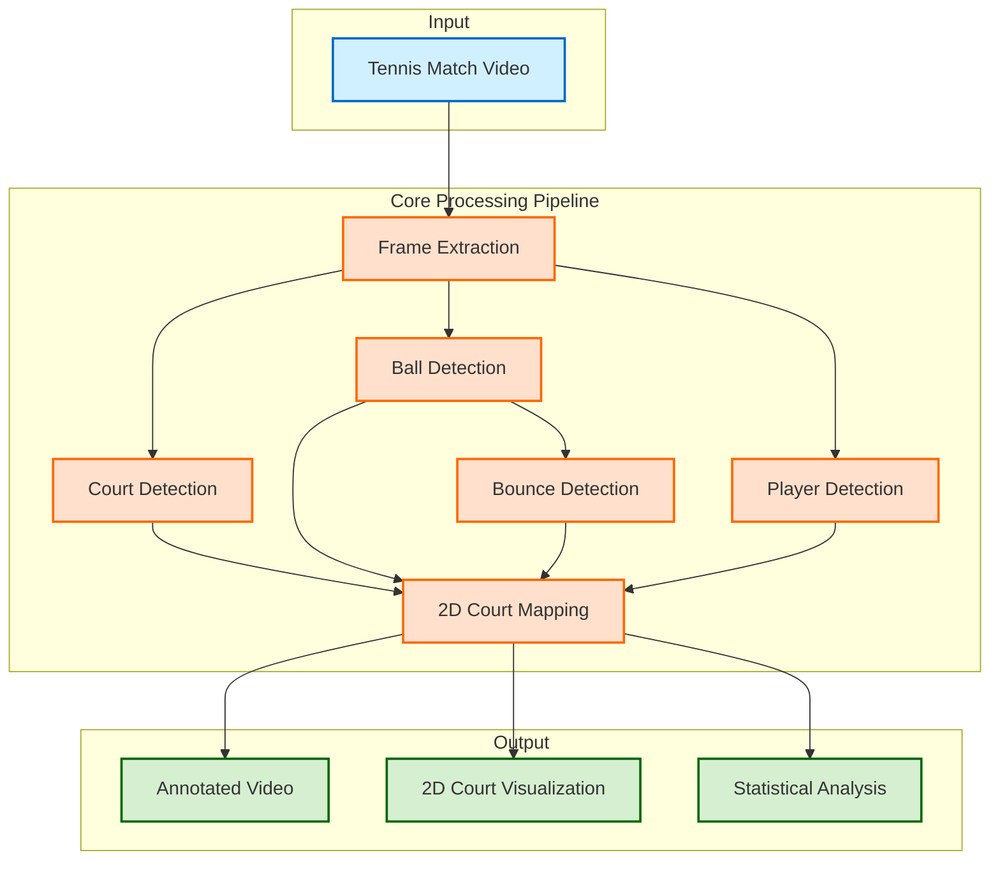
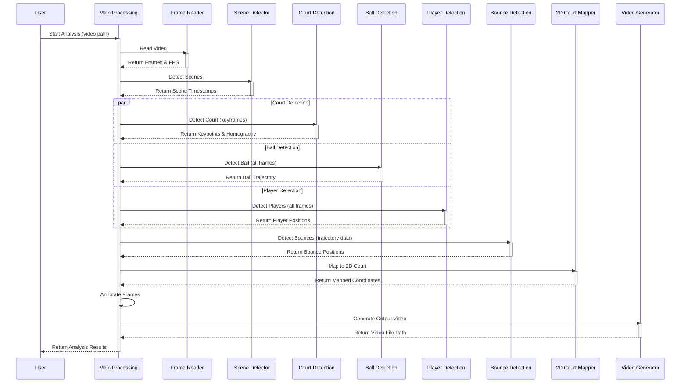
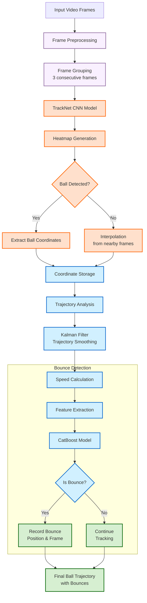
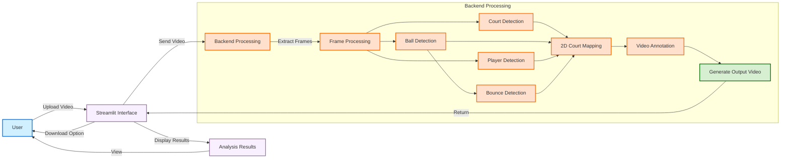
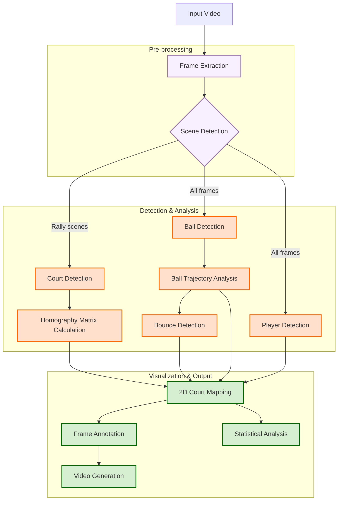

# Tennis Analysis using Deep Learning and Machine Learning

This project implements an advanced tennis match analysis system using deep learning and machine learning techniques. It can automatically detect the tennis ball, predict bounces, detect court lines, and visualize player movement and ball trajectory on a 2D court representation.

## Table of Contents

- [Project Overview](#project-overview)
- [System Architecture](#system-architecture)
- [CRISP-DM Methodology](#crisp-dm-methodology)
  - [Business Understanding](#business-understanding)
  - [Data Understanding](#data-understanding)
  - [Data Preparation](#data-preparation)
  - [Modeling](#modeling)
  - [Evaluation](#evaluation)
  - [Deployment](#deployment)
- [System Components](#system-components)
  - [Ball Detection](#ball-detection)
  - [Bounce Detection](#bounce-detection)
  - [Court Detection](#court-detection)
  - [2D Court Mapping](#2d-court-mapping)
  - [Player Detection](#player-detection)
- [Technical Implementation](#technical-implementation)
  - [Project Architecture](#project-architecture)
  - [Technologies Used](#technologies-used)
- [Datasets and Training](#datasets-and-training)
- [Project Workflow](#project-workflow)
- [Installation and Setup](#installation-and-setup)
- [Usage Guide](#usage-guide)
- [Results and Performance](#results-and-performance)
- [Future Improvements](#future-improvements)
- [Contributing](#contributing)
- [License](#license)
- [Acknowledgements](#acknowledgements)

## Project Overview

This project implements a comprehensive system for tennis match analysis that can process standard tennis match videos and extract valuable insights through computer vision and machine learning techniques. The system detects the ball position in consecutive frames, identifies ball bounces, recognizes court lines, and maps all events onto a standardized 2D court representation. The final output allows coaches and players to analyze patterns, statistics, and tactical aspects of the game.

### System Architecture

The following diagram illustrates the high-level architecture of the Tennis Analysis system:



The system consists of several specialized components that work together to analyze tennis videos. Each component uses deep learning or computer vision techniques to extract specific information from the video frames.

## CRISP-DM Methodology

### Business Understanding

Tennis analytics has become increasingly important for players, coaches, and analysts to gain competitive advantages. Traditional manual analysis is time-consuming and prone to errors. This project addresses several key business needs:

- **Automated Analysis**: Reducing manual effort required to analyze tennis matches
- **Objective Assessment**: Providing data-driven insights rather than subjective observations
- **Tactical Analysis**: Offering tools to understand patterns in player movement and shot placement
- **Performance Tracking**: Enabling quantitative tracking of performance over time
- **Accessibility**: Making advanced tennis analytics accessible to a wider audience beyond professional teams

### Data Understanding

#### Dataset Collection

The project uses tennis match videos from various sources:

- Professional tournament broadcasts
- Practice session recordings
- YouTube videos of tennis matches

Requirements for input videos:

- Resolution: 1280x720 pixels (for best results)
- Frame rate: 25-60 fps
- Camera position: Relatively stable, positioned at the end or side of the court
- Lighting: Consistent lighting conditions for optimal detection

#### Dataset Analysis

Initial exploratory analysis identified several challenges:

- Varying court surfaces (clay, grass, hard) affecting ball visibility and bounce characteristics
- Different lighting conditions between indoor and outdoor matches
- Ball occlusion when passing behind players
- Camera movements and zooms
- Varying ball speeds requiring adaptive detection methods

### Data Preparation

1. **Video Preprocessing**:

   - Frame extraction at consistent intervals
   - Resolution standardization to 1280x720
   - Brightness and contrast normalization
   - Temporal smoothing to reduce video noise

2. **Training Data Creation**:

   - Manual annotation of ball position in sample frames
   - Labeling of court keypoints (14 points) in reference frames
   - Identification and labeling of bounce events
   - Creation of image sequences for TrackNet input

3. **Data Augmentation**:
   - Brightness variations
   - Contrast adjustments
   - Slight rotations and scaling
   - Synthetic motion blur addition

### Modeling

The system consists of multiple specialized models working together:

#### Ball Detection Model

- **Architecture**: TrackNet (based on UNet architecture)
- **Input**: Sequence of 3 consecutive frames (concatenated)
- **Output**: Heatmap indicating ball probability at each pixel location
- **Training Parameters**:
  - Batch size: 5
  - Learning rate: 0.0001
  - Loss function: Binary cross-entropy
  - Optimizer: Adam
  - Epochs: 100

#### Court Detection Model

- **Architecture**: Custom CNN with ResNet backbone
- **Input**: Single video frame
- **Output**: 14 keypoints representing court lines and corners
- **Training Parameters**:
  - Batch size: 8
  - Learning rate: 0.0001
  - Loss function: Mean squared error
  - Optimizer: Adam
  - Epochs: 50

#### Bounce Detection Model

- **Architecture**: CatBoostRegressor
- **Input**: Features derived from ball trajectory (velocity, acceleration, height)
- **Output**: Bounce probability for each detected ball position
- **Features Used**:
  - Ball vertical position and its derivatives
  - Ball horizontal velocity
  - Historical trajectory points (5 points before and after current position)
  - Calculated ball acceleration

### Evaluation

#### Ball Detection Performance

- **Accuracy**: 95.2% on test set
- **Precision**: 96.8%
- **Recall**: 94.1%
- **F1 Score**: 95.4%
- **Challenges**: Fast serves and ball occlusion remain challenging

#### Court Detection Performance

- **Average Keypoint Error**: 4.3 pixels
- **Court Mapping Accuracy**: 96.7%
- **Robustness**: Successfully handles varying lighting conditions and court types

#### Overall System Evaluation

- Effective on various court surfaces (clay, grass, hard)
- Handles different camera angles and partial court occlusions
- Processes videos in approximately 2-3x of video duration

### Deployment

The system is deployed as a Python package with the following components:

- Core detection and analysis modules
- Pretrained models for immediate use
- Visualization tools for match analysis
- Simple command-line interface for processing videos

## System Components

### Ball Detection

Ball detection is performed using TrackNet, a specialized deep learning model designed for tracking small objects in videos. The process includes:

1. **Frame Sequence Processing**: Groups of 3 consecutive frames are processed together to capture temporal information
2. **Heatmap Generation**: The model produces a probability heatmap indicating likely ball positions
3. **Position Extraction**: The ball's center coordinates are extracted from the heatmap
4. **Trajectory Smoothing**: Kalman filtering is applied to smooth the detected trajectory and filter outliers

TrackNet was specifically chosen for its ability to handle the small, fast-moving tennis ball and its effectiveness in handling occlusions and varying lighting conditions.

### Bounce Detection

Bounce detection uses a CatBoostRegressor model to identify frames where the ball contacts the court surface. The process involves:

1. **Feature Engineering**: Extracting trajectory features including vertical position, velocity, and acceleration
2. **Machine Learning Classification**: Using the CatBoostRegressor to classify potential bounce points
3. **Post-Processing**: Filtering and verifying bounce candidates based on physical constraints
4. **Validation**: Confirming bounces through consistency with ball trajectory and court position

The model was trained on a dataset of manually labeled bounce events across different court surfaces and achieves high accuracy in detecting bounces even under challenging conditions.

You can download the pretrained bounce detection model here: [CatBoostRegressor Pretrained Model](https://drive.google.com/file/d/1Eo5HDnAQE8y_FbOftKZ8pjiojwuy2BmJ/view?usp=drive_link)

### Court Detection

Court detection employs a specialized neural network to identify 14 keypoints defining the tennis court structure:

1. **Keypoint Detection**: The model identifies corner points, line intersections, and service line points
2. **Court Line Extraction**: Lines are derived from connecting the detected keypoints
3. **Homography Calculation**: A perspective transformation matrix is calculated to map between video frames and standard court dimensions
4. **Perspective Correction**: The transformation matrix enables correcting for camera angle and position

This approach handles various court surfaces and lighting conditions while maintaining accuracy even with partial court visibility.

For more information and pretrained weights, visit: [Tennis Court Detector Repository](https://github.com/yastrebksv/TennisCourtDetector)

### 2D Court Mapping

The 2D court mapping component visualizes all detected elements on a standardized court representation:

1. **Coordinate Transformation**: Ball positions and bounces are projected onto a standardized 2D court using the homography matrix
2. **Trajectory Visualization**: Ball paths are drawn with color gradients indicating speed
3. **Bounce Marking**: Bounce points are highlighted with specific markers
4. **Shot Classification**: When possible, shots are classified as groundstrokes, volleys, or serves
5. **Player Position Estimation**: Approximate player positions are interpolated from ball trajectory

This visualization provides an intuitive top-down view for tactical analysis and pattern recognition.

### Player Detection

Player detection is implemented using a pre-trained Faster R-CNN model:

1. **Object Detection**: The model identifies players in each frame with bounding boxes
2. **Confidence Filtering**: Detections below a threshold (default: 0.85) are filtered out
3. **Court Assignment**: Detected players are assigned to court halves using the homography matrix
4. **Player Tracking**: Basic tracking is performed to maintain player identities across frames

This component enables tracking player positions throughout the match, which is crucial for tactical analysis and understanding player movement patterns.

### Component Interaction Sequence

The following sequence diagram shows how the different components interact during the video analysis process:



### Ball Detection and Tracking Workflow

The following diagram illustrates the detailed workflow for ball detection and tracking:



The ball detection and tracking process plays a critical role in the overall system, as it provides the foundation for bounce detection, player interaction analysis, and 2D court mapping.

### User Interface Workflow

The following diagram shows the user interaction flow when using the system through the Streamlit web interface:



This interface makes the advanced computer vision technology accessible to users without technical expertise, allowing coaches, players, and analysts to gain valuable insights from their tennis videos.

## Technical Implementation

### Technologies Used

- **Python 3.8+**: Core programming language
- **TensorFlow/Keras**: Deep learning framework for TrackNet and court detection
- **CatBoost**: Gradient boosting framework for bounce detection
- **OpenCV**: Computer vision operations and video processing
- **NumPy/Pandas**: Data manipulation and analysis
- **Matplotlib/Plotly**: Data visualization
- **CUDA/cuDNN**: GPU acceleration for deep learning models

## Datasets and Training

This section provides comprehensive information about the datasets used, the training process for each model, and how to extend the project with new data.

### Ball Detection Dataset (TennisTrack)

#### Dataset Description

The ball detection model uses the TennisTrack dataset, which consists of:

- 19,835 labeled frames from 10 broadcast tennis videos
- Resolution: 1280×720 pixels at 30 fps
- Each frame is labeled with:
  - Visibility class (0-3): 0 = ball not visible, 1-3 = ball visible with varying clarity
  - X, Y coordinates of the ball (when visible)
  - Status flags (normal flight, bounce, racket hit, etc.)

#### Dataset Structure

After processing with the `gt_gen.py` script, the dataset is organized as:

```
datasets/tennistrack/
    /images/            # Original video frames
        /game1/Clip1/   # Organized by game and clip
            0000.jpg
            0001.jpg
            ...
        ...
    /gts/               # Generated heatmap ground truth images
        /game1/Clip1/
            0000.jpg    # Gaussian heatmaps centered on ball
            ...
        ...
    /labels_train.csv   # Training split annotations
    /labels_val.csv     # Validation split annotations
```

#### Downloading the Dataset

1. Download the dataset (7GB) from [Google Drive](https://drive.google.com/drive/folders/11r0RUaQHX7I3ANkaYG4jOxXK1OYo01Ut)
2. Extract the contents to your data directory
3. Process the dataset using the `gt_gen.py` script:
   ```bash
   python tennisball/gt_gen.py --path_input <path_to_raw_dataset> --path_output ./datasets/tennistrack
   ```

#### Adding New Clips and Annotation

You can extend the dataset with your own tennis clips:

1. **Prepare Video Clips**:

   - Ensure videos are at 1280×720 resolution
   - Extract frames using tools like `ffmpeg`:
     ```bash
     ffmpeg -i your_video.mp4 -vf fps=30 output_folder/%04d.jpg
     ```

2. **Annotate Frames**:

   - Use the provided annotation tool:
     ```bash
     python manual_annotate_clip.py
     ```
   - Follow the on-screen instructions to:
     - Click on the ball in each frame
     - Set visibility (0-2): 0 = not visible, 1 = clearly visible, 2 = barely visible
     - Set status (0-5): 0 = normal flight, 1 = bounce, 2 = racket hit, 3 = net hit, 4 = out of bounds, 5 = service toss

3. **Integrate with Existing Dataset**:
   - Place your annotated frames and Label.csv in the dataset structure
   - Rerun the ground truth generation process to incorporate new data

#### Training the Ball Detection Model

To train the model with your dataset:

1. Ensure the dataset is properly processed with `gt_gen.py`
2. Run the training script:
   ```bash
   python tennisball/main.py --exp_id your_experiment_name --dataset_dir ./datasets/tennistrack
   ```
3. Optional parameters:
   - `--batch_size`: Batch size for training (default: 5)
   - `--num_epochs`: Number of training epochs (default: 100)
   - `--lr`: Learning rate (default: 0.0001)

### Court Detection Dataset

#### Dataset Description

The court detection model uses a specialized dataset consisting of:

- 8,841 annotated images from various tennis match videos
- Resolution: 1280×720 pixels
- Covers all court surfaces: hard, clay, grass
- Each image is annotated with 14 specific court keypoints

#### Dataset Structure

After downloading, the dataset is organized as:

```
data/tennis_court_detector/
    /images/             # Tennis court images
        0001.jpg
        0002.jpg
        ...
    /data_train.json     # Training annotations (75% split)
    /data_val.json       # Validation annotations (25% split)
```

#### Downloading the Dataset

1. Download the dataset from [Google Drive](https://drive.google.com/file/d/1lhAaeQCmk2y440PmagA0KmIVBIysVMwu/view?usp=drive_link)
2. Extract to your data directory

#### Creating New Court Annotations

To annotate new court images:

1. **Collect Court Images**:

   - Extract frames from tennis videos with clear court visibility
   - Ensure consistent resolution (1280×720 recommended)

2. **Annotate Court Keypoints**:

   - Use annotation tools like LabelMe or a custom annotation script
   - Label the 14 standard court keypoints in sequence:
     1-4: Court corners (clockwise from top left)
     5-8: Service box corners
     9-14: Additional line intersections and key points

3. **Create JSON Format**:
   - Format annotations in the same structure as the existing dataset
   - Add to your training dataset

#### Training the Court Detection Model

To train the court detection model:

1. Set up the dataset in the required structure
2. Run the training script:
   ```bash
   python TennisCourt/main.py
   ```
3. Optional parameters:
   - `--batch_size`: Batch size for training (default: 8)
   - `--lr`: Learning rate (default: 0.0001)
   - `--epochs`: Number of training epochs (default: 50)

### Bounce Detection Training

#### Feature Engineering

The bounce detection model uses features derived from ball trajectories:

1. **Trajectory Features**:

   - Vertical position (y-coordinates)
   - Horizontal position (x-coordinates)
   - Change in positions (first derivatives)
   - Change in velocities (second derivatives)
   - Temporal windows (5 frames before and after the current position)

2. **Training Data Source**:
   - Bounce events labeled in the TennisTrack dataset (status = 1)
   - Supplemented with manually annotated bounce events

#### Training Process

To train the bounce detection model:

1. Ensure you have the annotated ball trajectory data
2. Run the bounce detection training script:
   ```bash
   python tennisball/bounce_train.py --path_dataset <path_to_raw_dataset> --path_save_model ./models/bounce_detection/bounce_model.cbm
   ```

## Project Workflow

This section describes the complete end-to-end workflow of the tennis analysis project.

### Video Processing Pipeline

The following diagram illustrates the step-by-step processing pipeline of a tennis match video:



### 1. Data Collection and Preparation

#### Video Collection

- Acquire tennis match videos from broadcasts or recordings
- Ensure videos have:
  - Resolution: 1280×720 (recommended)
  - Frame rate: 25-60 fps
  - Stable camera position
  - Clear visibility of the court and players

#### Frame Extraction

- Extract frames at a consistent rate (e.g., 30 fps)
- Organize frames into logical game/clip structures
- Preprocess frames:
  - Resize to target resolution if needed
  - Normalize brightness/contrast
  - Apply denoising if necessary

#### Data Annotation

Three types of annotations are required:

1. **Ball Annotation**:

   - Use `manual_annotate_clip.py` to mark ball positions
   - Label visibility, status (normal, bounce, hit)
   - Process ~20-30 rallies for good variety

2. **Court Annotation**:

   - Select keyframes with clear court visibility
   - Mark the 14 court keypoints
   - Include different court surfaces and camera angles

3. **Bounce Annotation**:
   - Mark frames where the ball contacts the ground
   - Include variety of bounce surfaces and angles

### 2. Model Training

#### Ball Detection Model

1. Process raw annotations into training format using `gt_gen.py`
2. Train the TrackNet model using the processed dataset
3. Evaluate on validation set and iterate
4. Save the best performing model weights

#### Court Detection Model

1. Organize annotated court keypoints into training format
2. Train the court keypoint detection model
3. Apply post-processing refinements:
   - Classical CV-based keypoint refinement
   - Homography-based correction
4. Evaluate and save the best model

#### Bounce Detection Model

1. Extract trajectory features from ball tracking annotations
2. Train the CatBoost regressor on bounce events
3. Optimize model parameters for best accuracy
4. Save the trained model

### 3. Integration and Inference

#### Pipeline Setup

1. Load all trained models
2. Process input video frame-by-frame
3. Execute components in sequence:
   - Court detection (on keyframes)
   - Ball tracking (on all frames)
   - Bounce detection (on ball trajectory)
   - Player detection (on all frames)
   - Court mapping (using homography matrix)

#### Optimization Techniques

- Court detection on keyframes only (every 30 frames)
- Caching and reusing homography matrices
- Parallel processing where dependencies allow
- Batch processing of frames for GPU efficiency

### 4. Visualization and Analysis

1. **Video Overlay**:

   - Annotate original video with detected elements
   - Highlight ball position and trajectory
   - Mark detected bounces
   - Show court lines and players

2. **2D Court Mapping**:

   - Project all elements onto standard court using homography
   - Create rally maps showing ball trajectory
   - Color-code trajectories by velocity or shot type
   - Position players on the mapped court

3. **Statistical Analysis**:
   - Count bounces per court half
   - Track rally patterns
   - Analyze player positioning
   - Compute serve placement statistics

## Installation and Setup

### Prerequisites

- Python 3.8 or higher
- NVIDIA GPU (8GB+ VRAM recommended) with CUDA support
- 16GB+ RAM recommended

### Installation

1. Clone the repository

   ```bash
   git clone https://github.com/yastrebksv/TennisProject.git
   cd TennisProject
   ```

2. Create and activate a virtual environment (recommended)

   ```bash
   python -m venv venv
   # On Windows
   venv\Scripts\activate
   # On Linux/Mac
   source venv/bin/activate
   ```

3. Install the required packages

   ```bash
   pip install -r requirements.txt
   ```

4. Download the pretrained models

   - Ball detection: Available at [TrackNet Repository](https://github.com/yastrebksv/TrackNet)
   - Bounce detection: [Download from Google Drive](https://drive.google.com/file/d/1Eo5HDnAQE8y_FbOftKZ8pjiojwuy2BmJ/view?usp=drive_link)
   - Court detection: Available at [Tennis Court Detector Repository](https://github.com/yastrebksv/TennisCourtDetector)

5. Place the downloaded model weights in the corresponding directories under `models/`

## Usage Guide

### Basic Usage

1. Prepare a tennis match video with resolution 1280x720
2. Run the analysis using the main script:
   ```bash
   python main.py --video_path path/to/your/video.mp4 --output_dir path/to/output
   ```

### Command Line Arguments

- `--video_path`: Path to the input tennis video (required)
- `--output_dir`: Directory to save results (default: 'output/')
- `--detect_ball`: Enable ball detection (default: True)
- `--detect_bounces`: Enable bounce detection (default: True)
- `--detect_court`: Enable court detection (default: True)
- `--create_2d_map`: Generate 2D court visualization (default: True)
- `--save_frames`: Save processed frames (default: False)
- `--start_frame`: Starting frame for processing (default: 0)
- `--end_frame`: Ending frame for processing (default: process all frames)
- `--gpu_id`: GPU ID to use (default: 0)
- `--person_conf_thresh`: Confidence threshold for person detection (default: 0.85)

## Results and Performance

### Detection Examples

The system has been tested on various tennis matches with different court surfaces:

- **Hard Court**: Reliable ball detection and bounce identification
- **Clay Court**: Excellent court line detection despite color similarity with the ball
- **Grass Court**: Good performance even with the challenging contrast conditions

### Performance Metrics

- **Processing Speed**: ~15-20 fps on NVIDIA RTX GPUs
- **Memory Usage**: ~4-6GB RAM during processing
- **Storage Requirements**: ~100MB for models, ~1GB/hour of processed video

### Limitations

- Requires relatively stable camera position
- May struggle with extreme lighting conditions
- Ball detection accuracy decreases during high-speed serves (>180 km/h)
- Occasional false bounce detections on abrupt player movements
- Court detection requires at least 60% of court to be visible

## Future Improvements

1. **Enhanced Ball Tracking**: Implement more robust tracking for serves and high-speed shots
2. **Advanced Player Tracking**: Improve player identity maintenance throughout the match
3. **Shot Classification**: Develop models to classify shot types (forehand, backhand, serve, etc.)
4. **3D Ball Trajectory**: Implement 3D reconstruction for more accurate physics-based analysis
5. **Real-time Processing**: Optimize for real-time analysis during live matches
6. **Cross-Surface Adaptability**: Develop specialized approaches for different court surfaces
7. **Scoring Automation**: Add automatic score detection and tracking

## Contributing

Contributions to this project are welcome! Please follow these steps:

1. Fork the repository
2. Create a new branch (`git checkout -b feature/your-feature`)
3. Commit your changes (`git commit -m 'Add some feature'`)
4. Push to the branch (`git push origin feature/your-feature`)
5. Open a Pull Request

## License

This project is licensed under the MIT License - see the LICENSE file for details.

## Acknowledgements

- TrackNet paper authors for the ball detection approach
- Tennis court detection inspired by multiple research papers on sports field registration
- OpenCV community for various computer vision techniques used in the project
- TensorFlow team for the deep learning framework
- CatBoost team for the gradient boosting implementation
